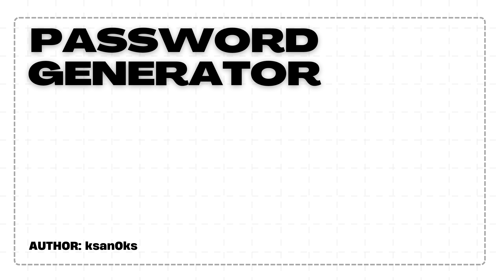

  
  

  
  

  <h1>Технологии:</h1>
  
  <h1>Функционал:</h1>
  
• Выбор символов

  
• Выбор заглавных букв, цифр или же специальные символы

  
• Вы можете скопировать сгенерированный пароль

  
Лицензия: <a href="https://github.com/ksan0ks/generator-password/blob/master/LICENSE.txt">MIT LICENCE

  
Почта: <a href="mailto:1.portal845@aleeas.com">1.portal845@aleeas.com

